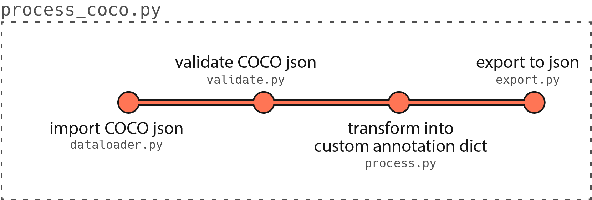

# LIME_dstest

This repository contains the solution to a task aimed at transforming a given dataset into a specific JSON format.

## Getting started

Download required annotation data:

```bash
wget http://images.cocodataset.org/annotations/annotations_trainval2017.zip
```

Unzip the data

```bash
unzip annotations_trainval2017.zip
```

## Process COCO annotations to custom annotations

Execute the script with the desired command-line arguments. Below are the available arguments:

| Argument                      | Description                                                         | Default Value            |
| ----------------------------- | ------------------------------------------------------------------- | ------------------------ |
| --coco_path                   | Path to the COCO JSON file.                                         | N/A                      |
| --export_path                 | Path to export the processed JSON file.                             | N/A                      |
| --overwrite                   | (Optional) Overwrite the export file if it already exists.          | False                    |
| --encoding                    | (Optional) List of encoding types used for keypoints.               | ['x', 'y', 'visibility'] |
| --supercategory               | (Optional) The supercategory for which keypoints are extracted.     | 'person'                 |
| --skip-incomplete-annotations | (Optional) Skip incomplete annotations instead of raising an error. | False                    |

Example useage:

```bash
python process_coco.py --coco_path /path/to/coco_dataset.json --export_path /path/to/exported_annotations.json
```


The COCO dict will be processed according to this pipeline

